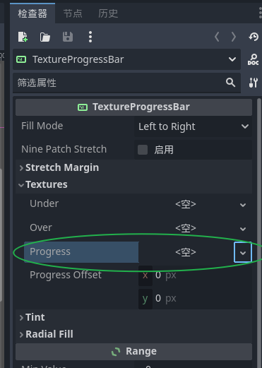

## 0 前言

这是一篇记录本人学些godot的blog，根据功能模块对内容进行串联，而功能模块完全参考我玩过的另一款像素RPG游戏。
而我本人是一个有经验的计算机领域从业者，主要使用C，编程能力一般，第一次学习游戏开发相关内容。

学习godot的最大理由还是它实在太轻便了，没有办法拒绝。
## 1 player
player正是我们的玩家，最重要的先登场，不考虑后面会进行怎么的扩展，player是大部分教程里，第一个教授的。
我先学习的也是player，player需要sprite、移动逻辑控制、以及碰撞检测
### 1.1 player的动画
player的基础节点 我选择了characterBody2D


由于做的是2D pixel游戏开发，在截图中可以看到一个层层递进的关系，
node -> CanvasItem -> Node2D -> *** -> CharacterBody2D

这就是一个继承的关系。

sprite，似乎是一个统称，我在其他引擎的介绍中，也看到了sprite。
sprite，我理解是object的外表。

添加动画有两种方法，AnimatedSprite2D 和 AnimationPlayer
#### 首先介绍第一种AnimatedSprite2D
Ctrl A搜索AnimationSprite2D


添加后AnimatedSprite2D的节点右边出现warning。

意思是提醒我们Sprite动画资源没有，也就是下面红色框住部分没有
那么接下来我们来为其添加，然后点击我们新建的SpriteFrames，中间下面的窗口出现动画帧窗口。

点击”从精灵表中添加帧“，
然后在文件夹中选择要用来做动画的sprite文件，

添加完在动画帧处发现了四帧动画：

然后切换到2D窗口，点击 " 动画帧：“下的播放就可以看到当前叫default的动画开始播放。

新的动画添加：


注意，SpriteFrames只能用于AnimatedSprite2D和AnimatedSprite3D，所以这里的动画无法保存用于AnimationPlayer。
#### 然后是AnimationPlayer
AnimationPlayer继承子Node -> AnimationMixer

正如node的名字，这是一个Animation的播放器（player），所以必须自己制作animation。

Animation的制作相比SpriteFrame更加复杂，适用于更多场景自由度更高。
首先添加Sprite2D node。


点击Sprite2D，来到右边的检查器，新建texture，你可以发现有新建 AnimatedTexture选项，但是很遗憾，你并没有AnimatedTexture。


将资源文件夹中的png直接拖到Texture的 <空> 中：

type其实是CompressedTexture2D。

开始编辑和选择帧的内容：

和前面的SpriteFrame的内容分割差不多，我们框出自己想要的全部内容：

切换到2D视图界面，就只有我们选择的4帧内容，
编辑区域的就好比对画布进行裁剪，我们只保留了自己想要的内容：


首先新建一个动画：

然后我们将分割的内容切成帧，**这里水平方向有4帧，所以Hframes设置为4，VFrames设置为1**：

接着在新建的动画上添加我们切好的帧，注意到之前的括号符号变成了钥匙符号：
 

这里Frame的编号是帧的编号，所以在添加Frame的时候需要添加4次，将4帧内容都加上去。

可以注意到动画总时长长达1S，但是只有4帧，播放到后面没有动画，可以改总时长，然后设置循环播放。


接下来就可以在AnimationPlayer的检查器中选择播放新增的这个动画 "idel"了：


这里有一个需要注意的点，Sprite2D应该是CharacterBody2D的子节点，而不是AnimationPlayer的子节点，不然动画会在固定位置播放，无法随着player单位的移动而移动。

### 1.2 player的基本控制
基本控制由脚本实现，通过直接添加脚本就能添加了。

首先点击左边的添加脚本，然后出现右边的《设置节点的脚本》，在模板里面选择Basic Movement模板，然后添加的脚本中就有最基本的移动功能了。
### 1.3 player的碰撞检测
在我们添加了characterBody2D node后，会发现左边的node tree会提示warning：

提示需要添加一个shape，一般使用CollisionShape2D，

添加后的CollisionShape2D也会有一个warning，
这是因为只添加了node没有给出具体的形状，在右边的检查器添加shape：

一般对于player，我们选择圆形shape，添加了shape后打开2d视图界面，
需要对shape进行合理调整，


这个shape的区域就是player的碰撞检测区域，可以通过这个shape和其他area的重叠进入碰撞等信号处理一系列游戏逻辑，后续会有所提及。
### 1.4 player和button的控制
这里说的button是在界面上新增的button，通过对button的触发对player的控制。
同时将这一行为抽象的看，也就是两个不同组件之间的逻辑控制相互影响。

预实现的功能是：对新增button的点击，player就会移动到button的旁边。

开始，
添加一个node2d node作为根node
并添加一个新的button node：


接下来为button添加脚本


脚本逻辑准备
首先是button这边拿到player node，然后将信息传递给player，脚本这样写：
```
extends Button

@export var player: NodePath
@export var move_to_position: Vector2

func _on_pressed():
	var player_node = get_node(player) as CharacterBody2D
	if player_node:
		player_node.Target_position = move_to_position
```
player在检查器中选择要影响的player，然后在代码中get_node()，将player_node的Target_Position设置为button想要的position；

然后是player这边的脚本逻辑，主要是将velocity设置为Target_Position然后调用move_and_slice()函数即可：
```
#省略
...
var Target_position = Vector2.ZERO

#省略
...
func _physics_process(delta):
	if Target_position != Vector2.ZERO:
		velocity = Target_position
		move_and_slide()
	else:
		move_and_slide()
```
我这里多了一个0检查，不是必须的。

一切正常的化，接下来启动后，点击button即可发现player朝指定位置移动了。
## 2  血条演示
血条我们选择的node是TextureProgressbar:

需要血条的素材，很简单，我们直接使用window的画图画出一个绿色的长条：

，接下来在progress中新建AtlasTexture，然后将画好的血条素材直接拖动到TextureProgressBar的Atlas进行裁剪：

点击编辑区域，只保留我们画的进度条：

保存，然后进行Range的属性编辑，


血条的制作可以这样，以此类推，可以做出其他状态条。
## 3 button的使用
### 3.1 简单的button触发

### 3.2 menu 菜单的制作

## 4 动画制作和播放
在1.1 player的动画中已经介绍了这player怎么使用这两种方法制作动画，其他动画也是一样制作。不再赘述。
### 4.1 animationplayer
省略。
### 4.2 animationSprite2D
省略。
## 5 Sence的切换
sence的切换通过area2d触发的方式进行演示，这也是在网上教程上dead area的做法相似，当area2d被触发后，重新加载当前的sence，即player 死亡，游戏失败重来，这里的切换只是将sence换成另一个sence而已。
添加area2d node：

将其放置在sence中：

和player一样，为area添加碰撞区域和脚本


脚本内容如下：
```
extends Area2D

# 定义一个常量
const NEW_SCENE_PATH: String = "res://sences/basicSence.tscn"

func _ready():
	pass

func load_scene():
	call_deferred("_deferred_load_scene")

func _deferred_load_scene():
	var scene_tree = get_tree()
	scene_tree.change_scene_to_file(NEW_SCENE_PATH)

func _on_body_entered(body):
	load_scene()
	pass # Replace with function body.

```

这样一个简单的player触发sence切换的demo就完成了，游戏重置就是重新加载当前sence。