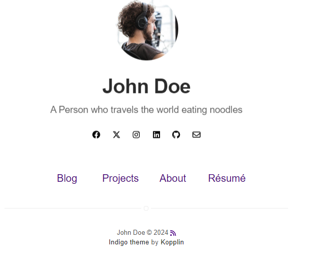
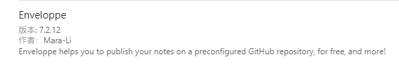
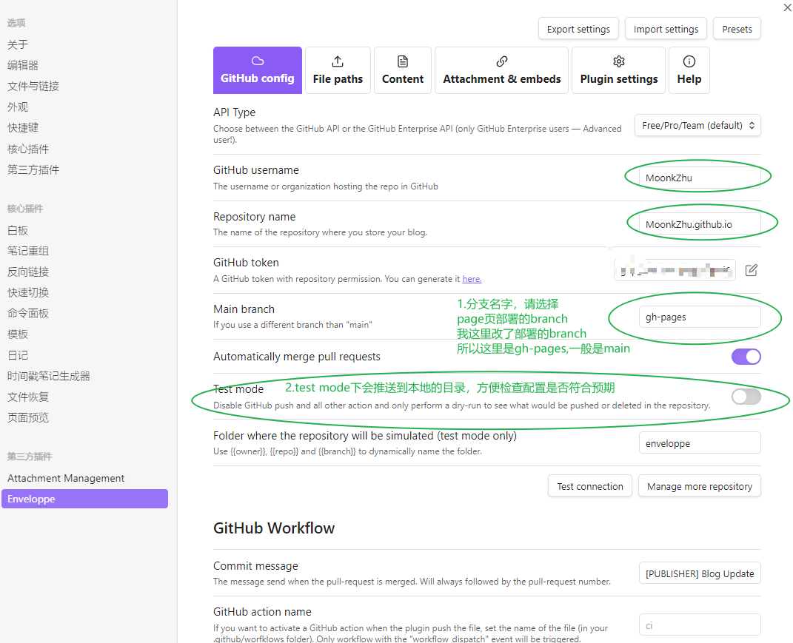
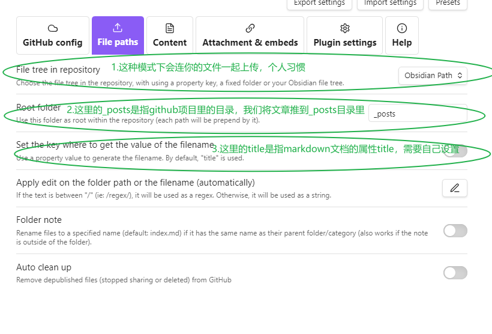
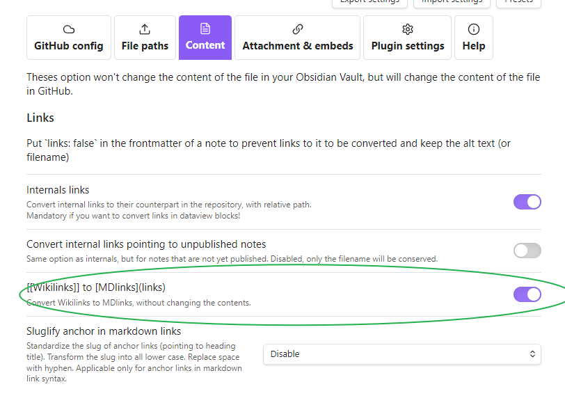
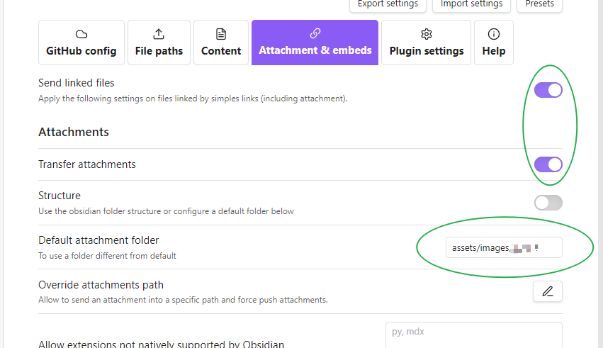
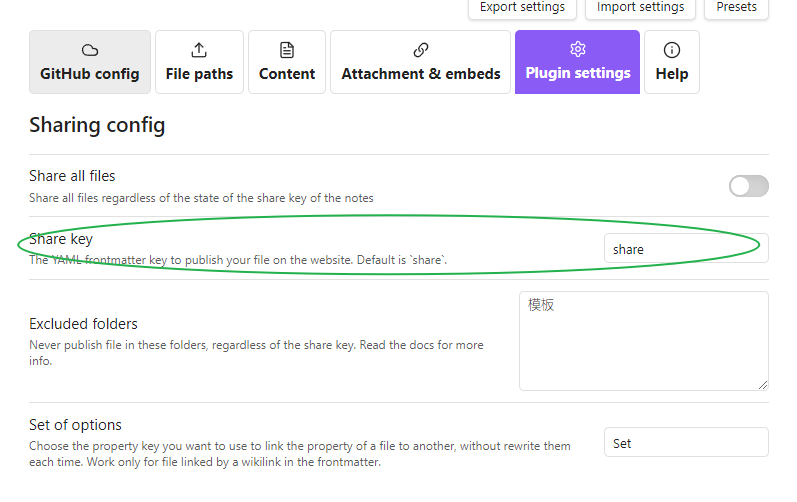
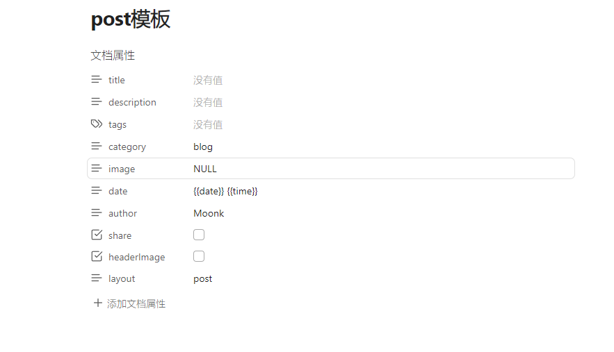
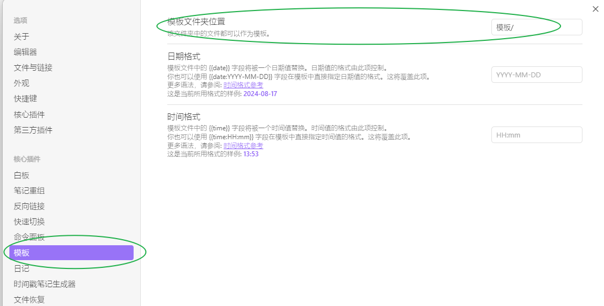
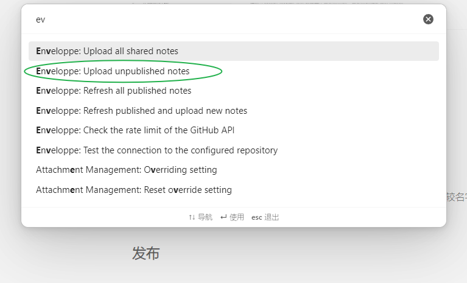

## 准备
- [ ] EnveLoppe。    Obsidian的插件，可以用于note的自动发布。
- [ ] google driver。其他云盘也可以，用于文件本身的备份
- [ ] github pages。 blog部署。
- [ ] jekyll模板。       blog模板，直接套用，在上面发布文章即可。 

## Blog启动
### 模板选择
首先选择一个博客模板，这样我们就可以只修改一些个人信息和添加文章内容即可。
我选择的模板：https://sergiokopplin.github.io/indigo/
效果如下：

github链接：https://github.com/sergiokopplin/indigo
### 本地启动预览
在项目的readme中直接介绍了如何在本地部署预览：
https://github.com/sergiokopplin/indigo/blob/gh-pages/README.md
### 注意点
**时间点**
config.yml中设置 future:true。
因为时差问题，可能新写的文章时间戳超越了github的服务器时间，这时候github page的部署会自动跳过这个文章的生成，导致出现jekyll本地部署可以看到自己的文章正常显示，但是上github page却没有的问题。

**post的识别**
推文的格式需要按照时间格式进行命名。

## Obsidian配置
Obsidian这边需要用到一个插件-Enveloppe。

接下来介绍一下这个插件如何配置，(可以直接导入配置)
**github config **

**File paths**

**Content**里比较重要的就是附件图片的格式，wiki链接格式不会被识别，所以我们勾选转换。

最后是 **Attachment & embeds**，下面的勾选可以使我们的图片什么的，用到的附件也被一起上传，并上传到指定的目录，这里我设置的是 assert/images/***


最后是Plugin setting，插件需要一个信息判断什么文章需要被上传，

Share key就是用来判断是否需要上传发布的关键字，在markdown的文章属性中添加这个属性并设置为true，那么插件就会将这个文档上传。


完成以上配置后，我们就可以开始写文章了。

## 模板设置
在前面我们说了，文章被插件发布以及文章上传后被jekyll识别生成html文件都要符合一定的条件。
1.文章文件名需要是时间格式+something.md
2.文章需要添加share属性被插件感知
3.文章需要添加一个头格式被jekyll生成html

这些我们都可以通过模板来解决，
我们在obsidian中添加模板，以这个模板为例：
在Obsidian中新建笔记保存：

```
---
title: 
description: 
tags: 
category: blog
image: "NULL"
date: "{{date}} {{time}}"
author: Moonk
share: false
headerImage: false
layout: post
---
```
然后设定模板的路径


后续如果想要发布文章在文章属性中插入模板，勾选share为true，并将比较名字改成时间格式即可。

### 发布
所有准备完毕，control + P用命令行publish即可。



---
最后，今天加班状态不好，写的浑浑噩噩的，改天有时间再录视频或者进行更多细节补充。