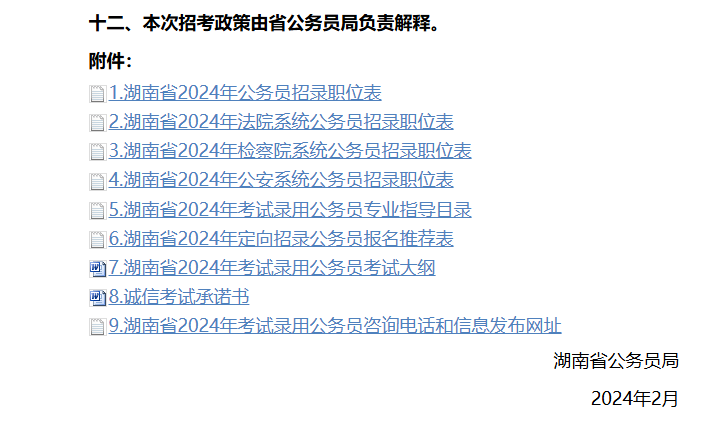
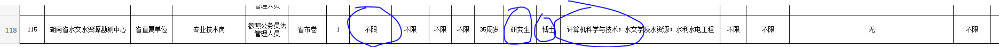

## 免责声明
本考公记录全根据本人记忆和经验书写，撰写过程中未进行任何资料查阅参考，如有错误疑点，请自行斟酌。
## 途径

考公上岸，有很多种类型，统称为考公，通往罗马的道路粗略分，有如下几条：

| 种类   | 考试科目              | 考试时间     | 优点                         | 缺点                                      | 推荐等级  | 航哥锐评                                                |
| ---- | ----------------- | -------- | -------------------------- | --------------------------------------- | ----- | --------------------------------------------------- |
| 选调生  | 未知（没考过）           | 9月-11月   | 最正的序列，无需多言                 | 马太效应严重，不是top学校的当多一次考试机会就行               | ⭐⭐⭐⭐⭐ | 如果你的嗅觉迟钝到看这篇记录才知道，那么这个路径应该已经被你错过了。                  |
| 省考   | 行测+申论+ （可能有的专业考试） | 一般3月-4月  | 离家近，岗位种类丰富，存在捡漏可能，最常见的考试途经 | 开出来的岗位每年不一样,专业受限，应届生受限、工作受限、政治身份受限都有可能。 | ⭐⭐⭐⭐  | 创造一个小镇望门的最好时间是20年前，其次是现在。                           |
| 国考   | 行测+申论+ （可能有的专业考试） | 11月      | 量大。                        | 对我们普通人而言，岗位适配性低，工作内容艰苦。                 | ⭐⭐⭐   | “最低年限”“西部艰苦地区”“工作强度大”“仅限男性，需要下矿山“ ”..." 这哪是上岸，这是流放。 |
| 事业单位 | 行测+申论+ 公基         | 不定期-关注公告 | 不了解                        | 不了解                                     | ⭐⭐⭐   | 不了解                                                 |
| 教师？  | 教师资格证(?) + 统招考试   | 不了解      | 不了解                        | 不了解                                     | ⭐⭐    | 去大专教python更好，不用考教师资格证                               |
|      |                   |          |                            |                                         |       |                                                     |

本文根据本人的亲身经历，记录本人参加省考的经历。
## 选岗

关注考试网公告，以湖南为例：
[湖南省2024年考试录用公务员公告_红星网_中共湖南省委组织部 (hxw.gov.cn)](https://www.hxw.gov.cn/content/2024/02/04/14463596.html)

在公告的最后附件会有岗位表：

岗位分为 **公检法 + 公务员**
可以依次下载附件筛选自己符合条件的岗位，我们随机看一个岗位：

大致就是 工作年限、是否应届生、是否党员、专业、学历 这些条件。

**考公是定向招聘**
和找工作一样，是先选定职位再进行招聘流程。

## 报考
**报考的岗位人越少，竞争压力越小**
通常情况下，可以通过途径看到选定岗位的实时报名人数，但是**事实上大家都是老阴比，很多都在最后一刻才锁定岗位** ，所以有可能出现，前面几天你选的这个岗位看起来没什么人报，但是截至后突然多了一大堆人的情况。

**如果你不是急于上岸，只是想进行一次模拟真考，不要在意什么受限，直接报考**
你的个人信息，年龄、专业、身份都是在通过了笔试之后才会进行材料check，所以只是想体验一下笔试，可以尽情报考。

本人选择了当时的技术侦察岗位，考试内容为 行测+申论+上机考试。
## 复习
两门笔试 行测和申论。

行测可以通过粉笔APP进行快速的提升，**行测给初试者一种错觉，”这题目好简单，我难道是考公天才？“**，然而行测比的是**得分效率**，行测的题目很多，一般做不完，那么就是怎么在这仅限的时间内拿到尽可能多的分，这也是复习的时候需要考虑和制定的策略。
多刷几次粉笔模考，多做几套试卷，看看做题技巧，粉笔APP的模考成绩和真实考试的成绩不会差很远。

申论我个人认为就是看天赋了。归纳总结这一套有些人很容易上手，但是对我而言，我个人有阅读障碍，所以每次申论都是60分左右，无法给出有效建议，多看讲解和多做会有帮助吧。

机试只给出了考纲，而且范围非常广，没有任何参考内容，所以我也没有任何准备。

## 考试
笔试的时间是统一的，如果像我一样有额外的机试，那么机试会单独组织在其他日期。

本人在完成了笔试后的周末，在某学校进行了机试。
机试过程一言难尽，充斥着混乱。
机试的题目和大学计算机基础的期末考试内容很像，广而浅，没有实操题，只是在机器上进行答题而言。

## 体测
本人报考的岗位存在体测，一般岗位不存在体测。
分为三项目：1000米-5分30秒、摸高-2.2米、折返跑
体测的第二天就是面试。
## 面试
关于面试是否需要报班，我的建议是，**如果你有试错的容错率，可以不报**。

面试需要客服的是大众面前讲话的紧张和讲话内容安排。
我大学的时候受辩论影响倒是不紧张，但是对于面试题的内容确实讲的十分空洞，没有条理。

而如果要报班，笔试成绩出来和面试之间只差了一周，所以**如果对自己比较有把握，一定提前报班进行面试相关培训，不然时间上来不及**。

本人意外自己竟然守擂进面（毕竟真是随便考考），所以没有报面试班，不出意外被翻盘了。
笔试和面试成绩 1：1 ，最终本人由第六名流转至第十五名，招8个人，出局。